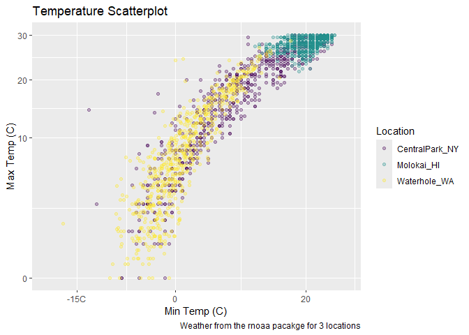

Data Visualization
================
2024-09-26

``` r
weather_df = 
  rnoaa::meteo_pull_monitors(
    c("USW00094728", "USW00022534", "USS0023B17S"),
    var = c("PRCP", "TMIN", "TMAX"), 
    date_min = "2021-01-01",
    date_max = "2022-12-31") %>% 
  mutate(
    name = case_match(
      id, 
      "USW00094728" ~ "CentralPark_NY", 
      "USW00022534" ~ "Molokai_HI",
      "USS0023B17S" ~ "Waterhole_WA"),
    tmin = tmin / 10,
    tmax = tmax / 10) %>% 
  select(name, id, everything())
```

    ## using cached file: C:\Users\adeen\AppData\Local/R/cache/R/rnoaa/noaa_ghcnd/USW00094728.dly

    ## date created (size, mb): 2024-09-26 10:18:38.832335 (8.668)

    ## file min/max dates: 1869-01-01 / 2024-09-30

    ## using cached file: C:\Users\adeen\AppData\Local/R/cache/R/rnoaa/noaa_ghcnd/USW00022534.dly

    ## date created (size, mb): 2024-09-26 10:19:04.863575 (3.94)

    ## file min/max dates: 1949-10-01 / 2024-09-30

    ## using cached file: C:\Users\adeen\AppData\Local/R/cache/R/rnoaa/noaa_ghcnd/USS0023B17S.dly

    ## date created (size, mb): 2024-09-26 10:19:13.03401 (1.038)

    ## file min/max dates: 1999-09-01 / 2024-09-30

``` r
weather_df %>% 
  ggplot(aes(x = tmin, y = tmax, color = name)) + 
  geom_point(alpha = .3) + 
  labs(
    title = "Temperature Scatterplot",
    x = "Min Temp (C)",
    y = "Max Temp (C)",
    color = "Location",
    caption = "Weather from the rnoaa pacakge for 3 locations"
  )
```

    ## Warning: Removed 17 rows containing missing values or values outside the scale range
    ## (`geom_point()`).

<!-- -->

Scales- start out with x and y

``` r
weather_df %>% 
  ggplot(aes(x = tmin, y = tmax, color = name)) + 
  geom_point(alpha = .3) + 
  labs(
    title = "Temperature Scatterplot",
    x = "Min Temp (C)",
    y = "Max Temp (C)",
    color = "Location",
    caption = "Weather from the rnoaa pacakge for 3 locations"
  ) +
  scale_x_continuous(
    breaks = c(-15, 0, 20),
    labels = c("-15C", "0", "20")
  ) +
  scale_y_continuous(
    limits = c(0, 30),
    transform = "sqrt"
  ) +
  viridis::scale_colour_viridis(discrete = TRUE)
```

    ## Warning in transformation$transform(x): NaNs produced

    ## Warning in scale_y_continuous(limits = c(0, 30), transform = "sqrt"): sqrt
    ## transformation introduced infinite values.

    ## Warning: Removed 302 rows containing missing values or values outside the scale range
    ## (`geom_point()`).

<!-- -->
